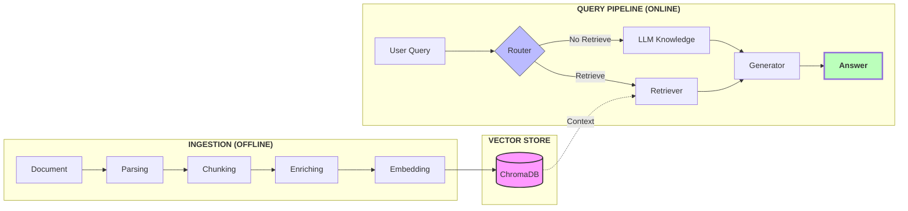

# Long-Doc QA: Technical Implementation

An AI system engineered for high-precision Q&A on documents exceeding 100 pages using structured parsing and agentic retrieval.

---

## 1. Project Overview

### 🎯 The Challenge
Building a system for single 100+ page documents that is:
* **Accurate:** Directly derived from the source.
* **Grounded:** Every answer includes page and section citations.
* **Robust:** Handles dense text, tables and narrative repetition.
* **Hallucination-Resistant:** Strict retrieval boundaries to prevent "creative" AI gaps.

### 🛠️ Core Strategy

To ensure a robust, grounded, and hallucination-resistant system for 100+ page documents in short time, I just focused on implementing high-level design in document ingestion and document retrieval, keep agent logic simple:

* **Advanced Parsing:** Used **Docling** to transform complex content (scanned PDFs, multi-page tables, and images) into structured data, preserving the document's original hierarchy.
* **Hybrid Chunking:** Applied **Hierarchical Chunking** with strict token limitations to maintain logical boundaries, enriched with "Contextual DNA" (metadata for section, page number, and table coordinates).
* **Storage & Hybrid Search:** Leveraged **ChromaDB** for lightweight local storage, utilizing a **Search Triad** (Semantic + Keyword + Metadata) to capture both conceptual and exact-match data.
* **Precision Re-ranking:** Integrated **FlashRank** to distill initial retrievals into the top 5 high-signal contexts, significantly reducing noise for the LLM.
* **Stateful Agent Logic:** Built with **LangGraph** to create a stateful agent, facilitating to handle agent logic from nodes.
* **Automated Evaluation:** Utilized **RAGAS** to quantitatively measure **Faithfulness**, **Answer Relevance**, and **Context Precision**, **Context Recall** across the long-form document.
---
## 2. System Design & Architecture

### 📄 Ingestion & Parsing
Instead of standard PDF parsers that lose formatting, I utilized **Docling** to transform the document into a structured representation.
* **Multimodal Support:** Robustly handles scanned PDFs, complex tables, and embedded images.
* **Memory-Optimized Parsing:** Implemented a **Sliding Page Window** (10-page range with a 2-page overlap). This ensures that structural elements (like headers or tables) that bridge across page boundaries are not "severed," maintaining context continuity while keeping the memory footprint low.

### ✂️ Chunking
To solve the "lost context" problem, the system uses a **Hybrid Hierarchical Chunker**:
* **Structural Awareness:** Chunks are aligned with document sections and page numbers rather than arbitrary character counts.
* **Metadata Enrichment:** Every chunk is "enriched" with its parent section header and page number. When the LLM reads a chunk, it knows exactly its location within the 100+ page document.
* **Token Optimization:** Chunks are constrained to a specific token limit to ensure the final context window doesn't become oversaturated with noise.

### 🧠 Embedding & Storage
* **Vector Store:** **ChromaDB** was selected for its lightweight, local-first footprint and its robust support for **Metadata Filtering**.
* **Local Efficiency:** Chroma provides fast semantic searching and filtering even with long documents in a lightweight setup, making it ideal for rapid development and testing without cloud overhead.

### 🔍 Retrieval Strategy
The system employs a multi-stage retrieval pipeline to maximize "groundedness":
* **Query Transformation:** The system rewrites the user's natural language query into a **Search Triad** (Semantic, Keyword, and Metadata filters) to capture both conceptual and exact-match data.
* **Hybrid Searching + Re-ranking:** Searching with factors in **the triad** to capture up to 15 candidates across all data layers, which FlashRank then distills into the Top 5 high-signal contexts to eliminate noise for the LLM.

### 🤖 Agentic Logic
The system is orchestrated using **LangGraph**. This allows to intervene into nodes, branching logics, which is useful to develop more complex iterative loop, multi-hop reasoning and self-correction agent.

---

## 3. System Architecture

---
## 4. Key Design Decisions & Trade-offs
### 4.1 AI Models
* **Decision:** use multiple AI models local python docling with its HuggingFace model dependencies, local AI model of Flashrank and api for OpenAI
* **Trade-off:** by using specialized AI models, I increase accuracy and cost-efficiency. However, it introduces hardward dependencies, requiring to manage a fragmented pipeline where local resource bottlenecks can stall the cloud-based agent's performance.
  
### 4.2 Data Ingestion & Parsing
* **Decision:** Used **Docling** (Layout-Aware) over basic Python libraries (e.g., *PyMuPDF*).
* **Trade-off:** Docling is **slower and CPU-intensive**, but it accurately reconstructs complex **financial tables**.
* **Optimization:** **Ignored images** to reduce VRAM usage and processing time.

### 4.3 Processing Strategy: Sliding Window
* **Decision:** Implemented a **10-page sliding window** for parsing with 2 pages overlapped.
* **Trade-off:** Increases total "walking" time through the document and creates duplicate chunks, but keeps **RAM usage low** and stable, preventing crashes on high-page-count documents.
* **Result:** Ensures "Contextual DNA" (metadata) is consistently captured across chunk boundaries.

### 4.4 Storage & Retrieval: ChromaDB
* **Decision:** Selected **ChromaDB** for the Vector Store.
* **Trade-off:** * **Pros:** Fast setup, low latency for local retrieval, and easy metadata filtering.
    * **Cons:** Limited horizontal scaling compared to cloud-native databases (e.g., Pinecone).

### 4.5 Agent 
* **Decision:** design linear agent logic, with simple router and one time retrieval, that ignores follow up questions.
* **Trade-off:** focus on power of document processing technique and retrieval method with low latency, but make chatbot less effective at dealing with complex questions.

---

## 5. Implementation Details
### 5.1 Prerequisites
* **Python:** 3.10 or higher.
* **Storage:** ~2GB free space for models and persistent vector database.
* **Memory:** 16GB RAM recommended for Docling's layout-aware parsing.
* **OpenAI API**

### 5.2 Environment Configuration
It is highly recommended to use a virtual environment to avoid dependency conflicts.

```bash
# Create a virtual environment
python -m venv venv

# Activate the environment (Windows)
.\venv\Scripts\activate

# Activate the environment (Mac/Linux)
source venv/bin/activate
```
**Setting OpenAI API key:** create .env file and set api key.
```bash
OPENAI_API_KEY = ...
```

### 5.3 Installing Dependencies
Ensure your virtual environment is active, then install all required libraries using the provided requirements file.

```bash
# Upgrade pip to ensure the latest package compatibility
python -m pip install --upgrade pip

# Install all project dependencies
pip install -r requirements.txt
```

### 5.4 Run Chatbot
Execute the main entry point to start the interactive session.

```bash
# Run the application as a module or direct script
python main.py
```
In terminal:
```text
--- LONG_DOC_AGENT ACTIVE ---
(Press Enter to skip if you don't have a document link)
Document link/path: 
```
Then
```text
Type 'exit' or 'quit' to stop.

User: exit
```

Time for document processing would be about 1 minute for 10 pages(depend on how complex it is)

### 5.5 Run Evaluation
* Build Knowledge Graph from chunks
```bash
python -m src.evaluation.kg_builder
```
In terminal:
```text
Running Extractors...
Applying HeadlinesExtractor: 100%|██████████| 74/74 [02:25<00:00,  1.96s/it]
Applying NERExtractor: 100%|██████████| 74/74 [02:26<00:00,  1.98s/it]
Cleaning up entity data...
Resolving synonyms for 152 entities...
Synonym resolution skipped: 'LangchainLLMWrapper' object has no attribute 'generate_json'
Building similarity links...
Applying JaccardSimilarityBuilder: 100%|██████████| 1/1 [00:00<00:00, 16.88it/s]
Enriching relationships with shared entities...
Enriched 80/80 relationships.
Success: Knowledge Graph saved to D:/long_doc_agent/data/chunks_store/user_upload_enriched_kg.json
```

* Generate Golden Dataset
```bash
python -m src.evaluation.data_generator
```
In terminal:
```text
Loading enriched Knowledge Graph from JSON...
KG Loaded: 139 nodes and 80 relationships found.
Phase 1: Planning 20 scenarios...
Phase 2: Writing Q&A pairs for 20 scenarios...
```

* Evaluating retriever
```bash
python -m src.evaluation.retrieval_eval
```

* Evaluating generation
```bash
python -m src.evaluation.generation_eval
```

> **Note:** This process is computationally intensive and time-consuming.

---

## 6. Evaluation & Testing

The pipeline is validated using the **Ragas** framework and a **Knowledge Graph (KG)** synthetic benchmarking approach to measure retrieval accuracy and generation quality.

---

### 6.1 Synthetic Dataset Generation
To avoid manual labeling bias, we utilized a **Knowledge Graph** to map document logic (e.g., `NVIDIA` → `PRODUCT` → `H100`). 
* **Golden Dataset:** 20 high-fidelity records including queries, context, and ground-truth references.
* **Query Types:** Includes **Single-Hop** (direct facts) and **Multi-Hop** (reasoning across multiple nodes).
* **Personas:** Queries are tailored to specific user roles to simulate real-world utility.

### 6.2 Key Metrics
Performance is tracked across the **RAG Triad** to isolate failures in the Retriever vs. the Generator.

| Component | Metric | Definition |
| :--- | :--- | :--- |
| **Retriever** | **Context Precision** | Signal-to-noise ratio; ensures top results are relevant. |
| | **Context Recall** | Verifies if all required info was successfully found. |
| **Generator** | **Faithfulness** | Detects hallucinations; answer must stay within context. |
| | **Answer Relevance** | How directly the response addresses the user query. |
| | **Answer Correctness** | Comparison against the KG-generated Golden Dataset. |

> **Note:** Generation metrics require high-tier reasoning models and are currently undergoing partial testing across the 20-record sample.

### 6.3 Evaluation Results

The system was benchmarked against two datasets to test scalability, processing speed, and accuracy.

| Benchmark | Scope | Content Type | Processing Time | Performance |
| :--- | :--- | :--- | :--- | :--- |
| **Baseline** | 20 Pages | Technical Paper | ~2 Minutes | **High Accuracy** |
| **Stress Test** | 130 Pages | NVIDIA FY25 Q4 | ~13 Minutes | **Performance Drop** |

*Result 1: High-precision metrics for technical documentation.*
```text
Evaluation Complete!
==================== FINAL SCORES ====================
Context Precision: 0.9075 / 1.0000
Context Recall: 0.8500 / 1.0000
```

*Result 2: Performance degradation in high-volume financial data.*
```text
Evaluation Complete!
==================== FINAL SCORES ====================
Context Precision: 0.7867 / 1.0000
Context Recall: 0.7208 / 1.0000
```

---

### 6.4 Key Takeaways

The transition from a 20-page technical paper to a 130-page financial report revealed three core challenges:

* **Processing Latency:** Document processing scales linearly at approximately **1 minute per 10 pages**. While acceptable for small sets, large financial filings (100+ pages) require asynchronous processing to maintain user experience.
* **Context Dilution:** Increased page volume introduced "noise," where the retriever struggled to capture relationship between chunks.

**Conclusion:** Scaling to 100+ pages requires more granular chunking and enhanced metadata filtering to prevent retrieval errors in dense datasets.

## 7. Limitations
### 1. Data & Parsing Limitations
* **Simple Parsing:** **Ignores figures and diagrams**, focusing strictly on text and table structures.
* **No Hierarchical Summary:** Lack of page-level or section-level summarization reduces the ability to find information based on high-level themes.

### 2. Retrieval & Reasoning Limitations
* **Linear Agent Logic:** **No multi-hop reasoning**; the agent cannot synthesize facts found in widely separated parts of the document (e.g., connecting Page 2 to Page 50).
* **Single-Stream Retrieval:** Does not apply multi-retriever or ensemble strategies, which can limit accuracy for complex technical queries.
* **Lacking of technical evaluation:** Does not evaluate impact of hybrid searching and reranking in depth.

### 3. Operational & Evaluation Limitations
* **No Checkpointing:** The pipeline lacks "resume" capabilities; if a 100-page document fails at page 90, the process must restart from page 1.
* **Cost-Limited Evaluation:** Generation quality and RAG metrics (e.g., RAGAS) are not quantitatively measured due to high LLM API running costs.
   
## 8. Future Roadmap
To move the **Long-Doc-Agent** from a Proof of Concept to a production-ready engine, the following enhancements are prioritized:

### 8.1 Advanced Reasoning & Retrieval
* **Multi-Hop Reasoning:** To handle complex queries, the agent executes Multi-Hop Reasoning by decomposing the prompt into logical sub-questions, retrieving targeted context for each, and synthesizing a comprehensive final response.

### 8.2 Resilience & State Management
* **Strategic Checkpointing:** Implement a persistent state layer (e.g., **Redis** or **SQLite**) to cache intermediate KG construction steps, allowing the system to resume processing if a 100+ page job fails mid-way.

### 8.3 Cost & Efficiency Optimization
* **Token Budgeting:** Integrate middleware to track and limit API usage per session.
* **Model Tiering:** Route simple lookups to "light" models (e.g., GPT-4o-mini) while reserving high-tier models for complex KG-driven reasoning.
---
