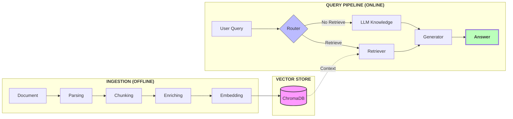

# Long-Doc QA: Technical Implementation

An AI system engineered for high-precision Q&A on documents exceeding 100 pages using structured parsing and agentic retrieval.

---

## 1. Project Overview

### 🎯 The Challenge
Building a system for 100+ page documents that is:
* **Accurate:** Directly derived from the source.
* **Grounded:** Every answer includes page and section citations.
* **Robust:** Handles dense text, tables and narrative repetition.
* **Hallucination-Resistant:** Strict retrieval boundaries to prevent "creative" AI gaps.

### 🛠️ Core Strategy

To ensure a robust, grounded, and hallucination-resistant system for 100+ page documents, I implemented the following high-level design:

* **Advanced Parsing:** Used **Docling** to transform complex content (scanned PDFs, multi-page tables, and images) into structured data, preserving the document's original hierarchy.
* **Hybrid Chunking:** Applied **Hierarchical Chunking** with strict token limitations to maintain logical boundaries, enriched with "Contextual DNA" (metadata for section, page number, and table coordinates).
* **Storage & Hybrid Search:** Leveraged **ChromaDB** for lightweight local storage, utilizing a **Search Triad** (Semantic + Keyword + Metadata) to capture both conceptual and exact-match data.
* **Precision Re-ranking:** Integrated **FlashRank** to distill initial retrievals into the top 5 high-signal contexts, significantly reducing noise for the LLM.
* **Stateful Agent Logic:** Built with **LangGraph** to create a stateful agent capable of iterative reasoning, query refinement, and self-correction if initial evidence is insufficient.
* **Automated Evaluation:** Utilized **RAGAS** to quantitatively measure **Faithfulness**, **Answer Relevance**, and **Context Precision**, **Context Recall** across the long-form document.
---
## 2. System Design & Architecture

The system is architected as a **Stateful RAG Agent** optimized for high-precision retrieval from dense, structural documents.

### 📄 Ingestion & Parsing
Instead of standard PDF parsers that lose formatting, I utilized **Docling** to transform the document into a structured representation.
* **Multimodal Support:** Robustly handles scanned PDFs, complex tables, and embedded images.
* **Memory-Optimized Parsing:** Implemented a **Sliding Page Window** (10-page range with a 2-page overlap). This ensures that structural elements (like headers or tables) that bridge across page boundaries are not "severed," maintaining context continuity while keeping the memory footprint low.

### ✂️ Chunking
To solve the "lost context" problem, the system uses a **Hybrid Hierarchical Chunker**:
* **Structural Awareness:** Chunks are aligned with document sections and page numbers rather than arbitrary character counts.
* **Metadata Enrichment:** Every chunk is "enriched" with its parent section header and page number. When the LLM reads a chunk, it knows exactly its location within the 100+ page document.
* **Token Optimization:** Chunks are constrained to a specific token limit to ensure the final context window doesn't become oversaturated with noise.

### 🧠 Embedding & Storage
* **Vector Store:** **ChromaDB** was selected for its lightweight, local-first footprint and its robust support for **Metadata Filtering**.
* **Local Efficiency:** Chroma provides fast semantic searching and filtering even with long documents in a lightweight setup, making it ideal for rapid development and testing without cloud overhead.

### 🔍 Retrieval Strategy
The system employs a multi-stage retrieval pipeline to maximize "groundedness":
* **Query Transformation:** The system rewrites the user's natural language query into a **Search Triad** (Semantic, Keyword, and Metadata filters) to capture both conceptual and exact-match data.
* **Factor-Based Searching:** The retriever searches across all factors first; it includes **fallback logic** where it relaxes constraints (e.g., broadening the metadata filter) if the primary search returns empty.
* **Precision Re-ranking:** We initially retrieve up to 15 potential contexts but use **FlashRank** to select the **Top 5** most relevant snippets. This ensures the LLM receives only high-signal data.

### 🤖 Agentic Logic
The system is orchestrated using **LangGraph** to manage state and complex decision-making:
* **Stateful Iteration:** Using a directed graph, the agent can maintain the state of the search and "loop back" to refine its query if the initial retrieval is insufficient.
* **Self-Correction:** The agent evaluates the retrieved evidence against the user's question before generating a response, significantly reducing the risk of hallucination in dense, 100-page contexts.

### Evaluation & Testing
The pipeline is evaluated using the **RAGAS** framework and a **Knowledge Graph** synthetic benchmarking approach to ensure accuracy.

* **Retriever Performance**
    * **Context Precision:** Measures the signal-to-noise ratio in retrieved chunks; ensures top results are relevant.
    * **Context Recall:** Verifies that all information required to answer the query was successfully found.

* **Generation Quality**
    * **Faithfulness:** Quantifies "Hallucination" by checking if the answer is derived *only* from retrieved context.
    * **Answer Relevance:** Measures how directly the response addresses the user's specific query.
    * **Answer Correctness:** Compares the final output against a ground-truth **Golden Dataset**.
    * *Note: Generation evaluation requires high-tier reasoning models and is currently in partial testing.*

* **Knowledge Graph & Synthetic Benchmarking**
    * **Entity Mapping:** Extracts relationships (e.g., `NVIDIA` → `PRODUCT` → `H100 GPU`) to map document logic.
    * **Golden Dataset Generation:**
        * **Single-Hop:** Simple data lookups (e.g., "What was the FY25 revenue?").
        * **Multi-Hop:** Reasoning across multiple tables (e.g., "Compare R&D spend to Data Center growth").
    * **Benchmarking:** Used as the ground truth to verify the Retriever and Generation.

---

## 3. System Architecture

---
## 4. Key Design Decisions & Trade-offs
### 4.1 Data Ingestion & Parsing
* **Decision:** Used **Docling** (Layout-Aware) over basic Python libraries (e.g., *PyMuPDF*).
* **Trade-off:** Docling is **slower and CPU-intensive**, but it accurately reconstructs complex **financial tables**.
* **Optimization:** **Ignored images** to reduce VRAM usage and processing time.

### 4.2 Processing Strategy: Sliding Window
* **Decision:** Implemented a **10-page sliding window** for parsing.
* **Trade-off:** Increases total "walking" time through the document but keeps **RAM usage low** and stable, preventing crashes on high-page-count documents.
* **Result:** Ensures "Contextual DNA" (metadata) is consistently captured across chunk boundaries.

### 4.3 Storage & Retrieval: ChromaDB
* **Decision:** Selected **ChromaDB** for the Vector Store.
* **Trade-off:** * **Pros:** Fast setup, low latency for local retrieval, and easy metadata filtering.
    * **Cons:** Limited horizontal scaling compared to cloud-native databases (e.g., Pinecone).

---

### Summary Table: Decision Matrix

| Component | Choice | Trade-off | Benefit |
| :--- | :--- | :--- | :--- |
| **Parser** | **Docling** | Slower speed | High Table Accuracy |
| **Images** | **Excluded** | Loses Visual Data | ~70% Less Memory |
| **Database** | **ChromaDB** | Local Scaling | Instant Setup/Search |

---

## 5. Implementation Details
### 5.1 Prerequisites
* **Python:** 3.10 or higher.
* **Storage:** ~2GB free space for models and persistent vector database.
* **Memory:** 16GB RAM recommended for Docling's layout-aware parsing.

### 5.2 Environment Configuration
It is highly recommended to use a virtual environment to avoid dependency conflicts.

```bash
# Create a virtual environment
python -m venv venv

# Activate the environment (Windows)
.\venv\Scripts\activate

# Activate the environment (Mac/Linux)
source venv/bin/activate
```

### 5.3 Installing Dependencies
Ensure your virtual environment is active, then install all required libraries using the provided requirements file.

```bash
# Upgrade pip to ensure the latest package compatibility
python -m pip install --upgrade pip

# Install all project dependencies
pip install -r requirements.txt
```

### 5.4 Run Chatbot
Execute the main entry point to start the interactive session.

```bash
# Run the application as a module or direct script
python main.py
```
image

### 5.5 Run Evaluation
-Build Knowledge Graph from chunks
```bash
python -m src.evaluation.kg_builder
```
image

-Generate Golden Dataset
```bash
python -m src.evaluation.data_generator
```
image

-Evaluating retriever
```bash
python -m src.evaluation.retrieval_eval
```
image

-Evaluating generation
```bash
python -m src.evaluation.generation_eval
```
image

6. Evaluation & Testing

7. Assumptions & Limitations
   
8. Future Roadmap (The "If I had more time" section)
